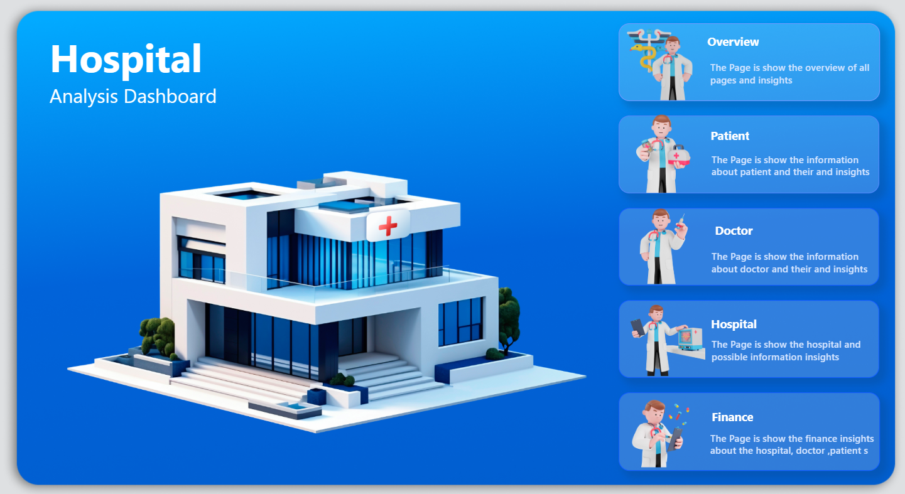
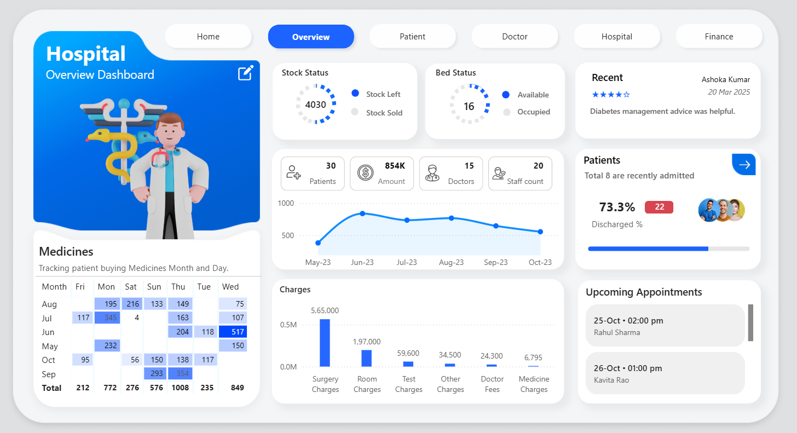

# Description
Hospital Data Insights Dashboard is a Power BI project designed to visualize key hospital metrics such as patient admissions, bed occupancy, department performance, and treatment trends — enabling healthcare professionals to make informed, data-driven decisions.

# 🏥 Hospital Data Insights Dashboard

This repository showcases a **Power BI Dashboard** project designed to provide insights into hospital operations and patient statistics. The project focuses on visualizing key healthcare metrics, enabling data-driven decision-making.

> ⚠️ *Note: The actual `.pbix` file and original data are not uploaded to protect confidential or sensitive information.*

---

## 📊 Project Overview

The Hospital Dashboard provides an interactive and insightful view of hospital performance using structured visualizations. It helps stakeholders monitor:

- 🔹 Patient admissions and discharges
- 🔹 Bed occupancy rate
- 🔹 Department-wise efficiency
- 🔹 Average patient stay duration
- 🔹 Monthly trends in patient visits and outcomes

---

## 🧩 Key Features

- 📌 **Dynamic filters and slicers** for time, department, and patient type
- 📌 **Custom KPIs** built using DAX (e.g., Average Stay Duration, Utilization Rate)
- 📌 **Clear layout** with segmented views for administration, operations, and trends
- 📌 **Data model optimized** using Power Query transformations

---

## 📷 Dashboard Snapshots

### ✅ Home Page

### ✅ Overview Page

### ✅ Patient Trends

---

## 🛠️ Tools & Technologies

| Tool         | Purpose                         |
|--------------|----------------------------------|
| Power BI     | Data modeling & visualization    |
| DAX          | Calculated measures & KPIs       |
| Power Query  | Data cleansing & transformation  |
| Excel/CSV    | Data source (anonymized)         |

---

## 🚀 How to Use

To protect sensitive information, the core Power BI file is **not shared**. However, you can:

1. View screenshots in `/screenshots/` for visual reference.
2. Review this README and documentation for understanding the dashboard logic.

---

## 🙋‍♂️ About Me

I'm passionate about turning raw data into meaningful insights through interactive dashboards and analytical models. Connect with me:

- 💼 [LinkedIn]([https://linkedin.com/in/yourprofile](https://www.linkedin.com/in/aaditya-singh-888935230/))

---

## 📌 License

This project is shared for educational and portfolio purposes. All trademarks and data references belong to their respective owners.

